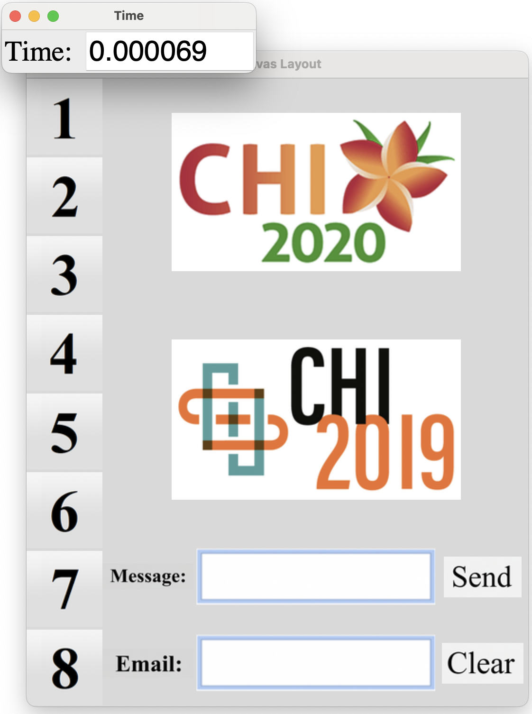
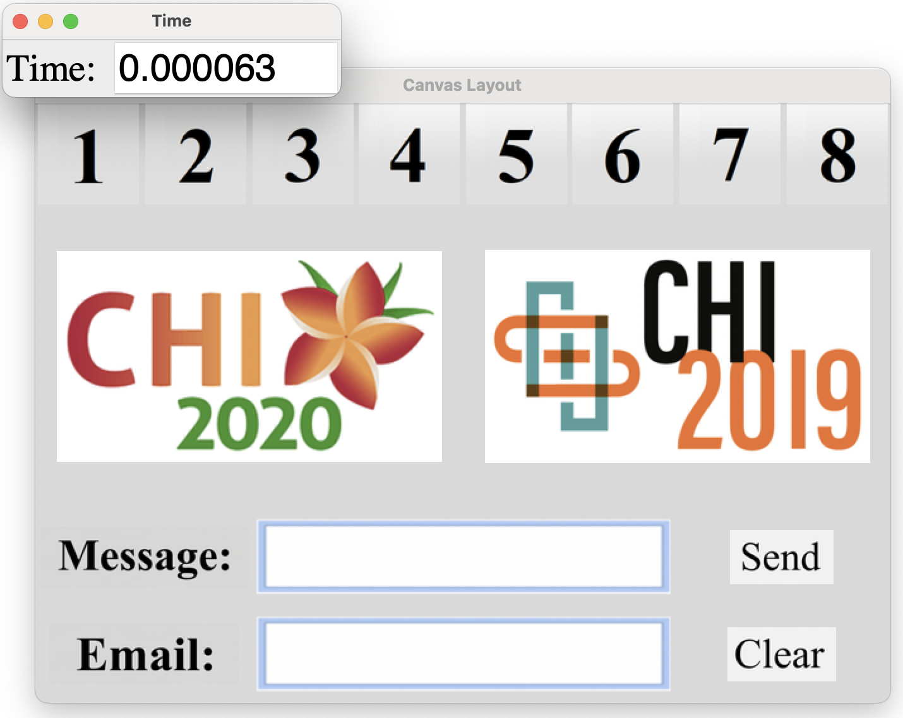
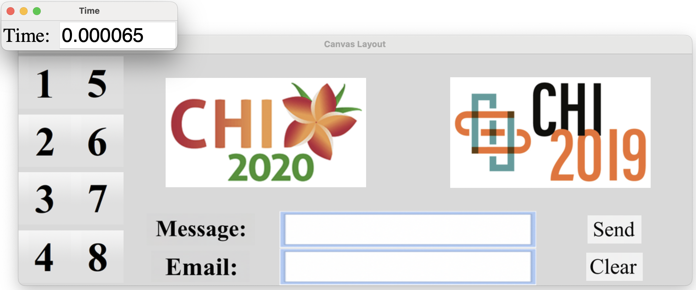

# ReverseORC (CHI2021)

This repository contains the hierarchical ReverseORC GUI layout solver for DOM-like widget trees. The hierarchical solver measures groups bottom-up and places them top-down, solving only siblings together. This keeps local solve sizes small while parent groups continue to coordinate the space assigned to their children.

## Sample results

The layout automatically adapts its structure and widget sizes to the
available window dimensions.

| Result 1 | Result 2 | Result 3 |
|:---:|:---:|:---:|
|  |  |  |

## Publication

### ReverseORC: Reverse Engineering of Resizable User Interface Layouts with OR-Constraints

[Yue Jiang](https://yuejiang-nj.github.io/) ·
[Wolfgang Stuerzlinger](https://www.sfu.ca/siat/people/research-faculty/wolfgang-stuerzlinger.html) ·
[Christof Lutteroth](https://people.bath.ac.uk/cl2073/)

ACM CHI Conference on Human Factors in Computing Systems, 2021

[Paper](https://yuejiang-nj.github.io/Publications/2021CHI_ReverseORC/paper.pdf) ·
[Video](https://www.youtube.com/watch?v=uBVRtUvLFSk) ·
[BibTeX](citations/reverseorc.bib)

## Related publications

### ORCSolver: An Efficient Solver for Adaptive GUI Layout with OR-Constraints

[Yue Jiang](https://yuejiang-nj.github.io/) ·
[Wolfgang Stuerzlinger](https://www.sfu.ca/siat/people/research-faculty/wolfgang-stuerzlinger.html) ·
[Matthias Zwicker](https://www.cs.umd.edu/~zwicker/) ·
[Christof Lutteroth](https://people.bath.ac.uk/cl2073/)

ACM CHI Conference on Human Factors in Computing Systems, 2020

[Paper](https://yuejiang-nj.github.io/Publications/2020CHI_ORCSolver/paper.pdf) ·
[Video](https://www.youtube.com/watch?v=5SAZ8iDKFhc) ·
[BibTeX](citations/orcsolver.bib)

### ORC Layout: Adaptive GUI Layout with OR-Constraints

[Yue Jiang](https://yuejiang-nj.github.io/) ·
[Ruofei Du](https://ruofeidu.com/) ·
[Christof Lutteroth](https://people.bath.ac.uk/cl2073/) ·
[Wolfgang Stuerzlinger](https://www.sfu.ca/siat/people/research-faculty/wolfgang-stuerzlinger.html)

ACM CHI Conference on Human Factors in Computing Systems, 2019

[Paper](https://yuejiang-nj.github.io/Publications/2019CHI_ORCLayout/paper.pdf) ·
[Video](https://www.youtube.com/watch?v=eiEmLTfPDZQ) ·
[BibTeX](citations/orc-layout.bib)


## Repo
The repository is organized into four directories:

```text
ReverseORC_CHI2021/
├── images/
├── ORCSolver/          # Original non-hierarchical solver (ORCSolver)
├── ReverseORCSolver/   # Hierarchical Python solver
└── ReverseORCSolver_C++/ # Hierarchical C++ solver with a Python API
```

## Requirements

The examples use Python 3, Tkinter, Pillow, CVXPY, and NumPy. Install the
Python packages with:

```bash
python -m pip install pillow cvxpy numpy
```

Tkinter is included with many Python distributions. Test it with
`python -m tkinter`; if that fails, install Tk support through your Python or
operating-system package manager. Image assets are loaded from `images/`.

## Hierarchical examples

From the repository root, run the hierarchical examples with:

```bash
python ReverseORCSolver/hierarchical_teaser_example.py
python ReverseORCSolver/hierarchical_video_example.py
python ReverseORCSolver/hierarchical_simple_flow_pattern.py
python ReverseORCSolver/hierarchical_connected_flow_pattern.py
python ReverseORCSolver/hierarchical_optional_widgets_pattern.py
python ReverseORCSolver/hierarchical_balanced_flow_pattern.py
python ReverseORCSolver/hierarchical_flow_around_pattern.py
```


## Choosing the window size

Pass the width and height as positional arguments:

```bash
python ReverseORCSolver/hierarchical_teaser_example.py 640 480
```

If dimensions are omitted, each example uses its original default size. The
teaser default is 640×480.

## Running without a window

Use `--headless` to skip the GUI and print the solving time and every resulting
group/widget box:

```bash
python ReverseORCSolver/hierarchical_teaser_example.py 640 480 --headless
```

Example output:

```text
pattern: teaser
window: 1046 x 760
solver_time_seconds: 0.000616626
local_solves: 7
levels: 5
result:
  canvas: left=0.000 top=0.000 width=1046.000 height=760.000
  HF1: left=0.000 top=0.000 width=80.000 height=760.000
  ...
```

Use `--time-only` for benchmarking. It opens no window and prints one numeric
line containing only the solver time in seconds:

```bash
python ReverseORCSolver/hierarchical_teaser_example.py 640 480 --time-only
```

Example output:

```text
0.000773083
```

`--headless` and `--time-only` are mutually exclusive and are available on all
hierarchical example scripts.

## C++ hierarchical solver

`ReverseORCSolver_C++` implements the same hierarchical algorithm in C++17 and
exposes it to Python through a CPython extension. Layouts are still defined in
Python, while intrinsic measurement, flow wrapping, weighted allocation, box
placement, and objective calculation execute in C++.

The native version requires a C++17 compiler, Python development headers, and
setuptools. Build it from the repository root with:

```bash
cd ReverseORCSolver_C++
python setup.py build_ext --inplace
```

After building, run the same seven patterns:

```bash
python hierarchical_teaser_example.py
python hierarchical_video_example.py
python hierarchical_simple_flow_pattern.py
python hierarchical_connected_flow_pattern.py
python hierarchical_optional_widgets_pattern.py
python hierarchical_balanced_flow_pattern.py
python hierarchical_flow_around_pattern.py
```

The C++ launchers support the same optional dimensions, `--headless`, and
`--time-only` modes:

```bash
python hierarchical_teaser_example.py 640 480 --headless
python hierarchical_teaser_example.py 640 480 --time-only
```

The C++ `--time-only` value is measured with
`std::chrono::steady_clock` directly around the native `Solver::solve()` call.
It excludes Python serialization, conversion into C++ nodes, conversion of
results back to Python, GUI work, rendering, and output formatting. For the
teaser it is the sum of both native orientation solves.

Use the native solver directly from Python with:

```python
from hierarchical_patterns import teaser_layout
from hierarchical_solver_cpp import HierarchicalSolver

root = teaser_layout("column")
result = HierarchicalSolver().solve(root, width=640, height=480)
print(result.boxes["CHI2020"])
```

See the [C++ solver README](ReverseORCSolver_C++/README.md) for implementation,
build, and API details.

## Original non-hierarchical examples

The original runnable examples support the same positional size arguments and
output modes:

```bash
python ORCSolver/teaser_example.py 
python ORCSolver/video_example.py 
python ORCSolver/simple_flow_pattern.py 
python ORCSolver/connected_flow_pattern.py 
python ORCSolver/optional_widgets_pattern.py 
python ORCSolver/balanced_flow_pattern.py 
python ORCSolver/flow_around_pattern.py 
```

Run an original example without Tk windows and print its time and result:

```bash
python ORCSolver/teaser_example.py 640 480 --headless
```

Print only its solver time as one numeric line:

```bash
python ORCSolver/teaser_example.py 640 480 --time-only
```

These options apply to runnable example and pattern files. The original solver
is isolated in the `ORCSolver/` directory. Library modules such as
`ORCSolver/flow_solver.py`, `ORCSolver/orclayout_classes.py`,
`ReverseORCSolver/hierarchical_solver.py`, and `ORCSolver/legacy_cli.py` are
imported APIs and therefore do not expose example CLI options.

## Timing definition

Reported time includes only calls to `HierarchicalSolver.solve()`. It excludes:

- hierarchy and GUI construction;
- responsive pivot selection;
- PIL image loading and resizing;
- ImageTk conversion;
- Canvas drawing and window updates;
- terminal result formatting.

For the teaser, both responsive root-pivot candidates are solved. The reported
solver time is the sum of those solver calls; construction and selection of the
winning candidate remain excluded.

## Using the hierarchical solver directly

Run this example from the `ReverseORCSolver` directory:

```bash
cd ReverseORCSolver
```

```python
from hierarchical_patterns import teaser_layout
from hierarchical_solver import HierarchicalSolver

dom = teaser_layout("column")
result = HierarchicalSolver().solve(dom, width=640, height=480)

print(result.boxes["HF1"])
print(result.boxes["CHI2020"])
```

Existing `ORCWidget` instances can be adapted with:

```python
hierarchical_widget = Widget.from_orc_widget(existing_orc_widget)
```

`LayoutResult.legacy_boundaries()` returns `name_l`, `name_r`, `name_t`, and
`name_b` values compatible with the original example result format.

## Tests

From the repository root, run both test suites with:

```bash
python -m unittest discover -s ORCSolver -v
python -m unittest discover -s ReverseORCSolver -v
```

Build and test the C++ version with:

```bash
cd ReverseORCSolver_C++
python setup.py build_ext --inplace
python -m unittest -v
```

The tests cover hierarchical containment, weighted allocation, flow wrapping,
legacy boundary output, all visual patterns, responsive teaser pivots,
corresponding-element size equality, image availability, custom window sizes,
and time-only output.

More implementation details are available in
[`HIERARCHICAL_SOLVER.md`](ReverseORCSolver/HIERARCHICAL_SOLVER.md).
